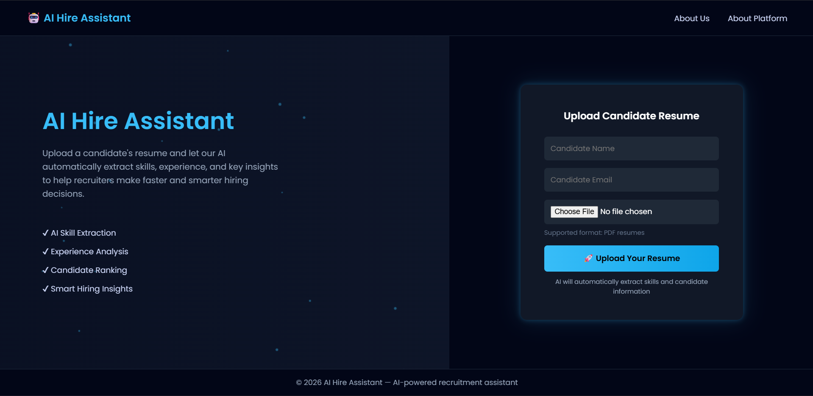
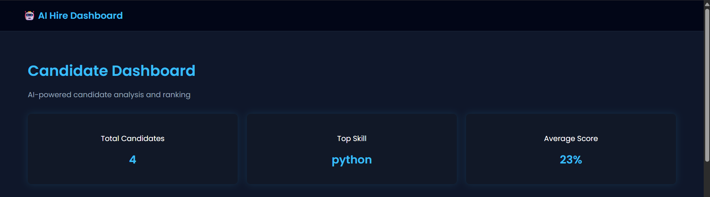
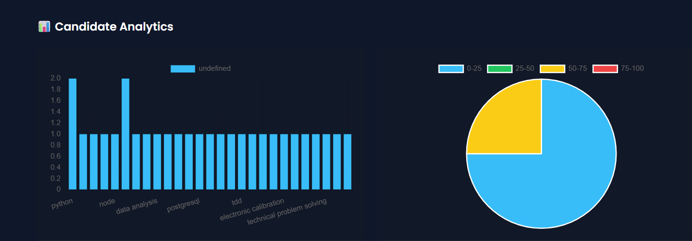
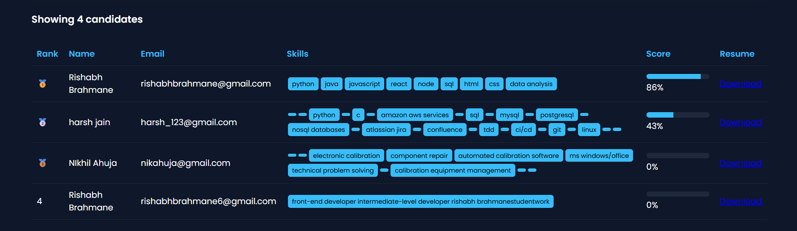

# 🤖 AI Hire Assistant

AI Hire Assistant is an AI-powered recruitment system that analyzes resumes, extracts candidate skills, and ranks candidates based on job requirements.

The system helps recruiters quickly identify the best candidates using AI-driven insights and skill matching.

---

## 🚀 Features

- Resume Upload System
- AI Resume Skill Extraction
- Candidate Skill Analysis
- AI Job Description Analyzer
- Candidate Ranking System
- Skill Match Scoring
- Best Candidate Recommendation
- Resume Preview & Download
- Candidate Analytics Dashboard
- Skill Distribution Charts
- Score Distribution Charts

---

## 🛠 Technologies Used

### Frontend
- HTML
- CSS
- JavaScript
- Chart.js

### Backend
- Node.js
- Express.js

### Database
- MySQL
- XAMPP

### AI Processing
- Python
- Resume Skill Extraction

---

## 📊 How the System Works

1. Recruiter uploads candidate resume.
2. AI extracts skills from the resume.
3. Candidate data is stored in MySQL database.
4. Recruiter enters job description.
5. AI extracts required job skills.
6. System compares candidate skills with job requirements.
7. Candidates are ranked based on match score.
8. Best candidate is recommended.

---

## 🧠 AI Logic

The system calculates candidate score using skill matching.

Example:
Required Skills: python, sql, node
Candidate Skills: python, sql, html
Score = 2 / 3 = 66%

---

## 📷 Dashboard Preview

(Add screenshots here)

Example:

- Candidate Dashboard
- Resume Upload Page
- Candidate Ranking System

---

## 🎯 Future Improvements

- AI Resume Summary
- Recruiter Chatbot
- Email Notification System
- Candidate Interview Prediction

---

## 👨‍💻 Author

**Rishabh Brahmane**

Computer Science Student  
Interested in Data Analytics & AI Projects

---

## ⭐ Project Purpose

This project was developed as a **Semester Program(Code Unnati by edunet foundation) Project** to demonstrate the use of **AI in recruitment automation**.

## 📷 Project Screenshots

### Resume Upload Page

### AI Dashboard

### Candidate Analytics

### AI Recommendation System

### Candidate List

